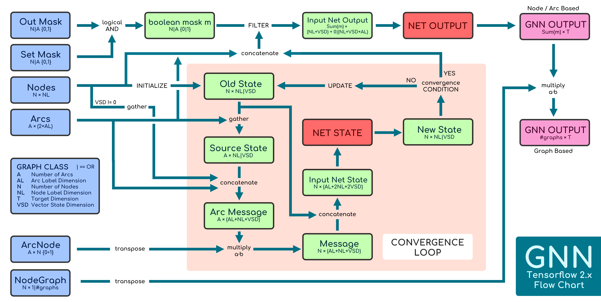

# GNN - Graph Neural Network Model
This repo contains a Tensorflow 2.x implementations of the Graph Neural Network (GNN) Model.

**Authors:** [Niccolò Pancino](http://sailab.diism.unisi.it/people/niccolo-pancino/), [Pietro Bongini](http://sailab.diism.unisi.it/people/pietro-bongini/)

## Simple usage example
In the following scripts, gnn is a by default a binary classifier for node-focused task on graphs with random nodes/edges/targets.

Open the script `starter` and set parameters in section *SCRIPT OPTIONS* to change dataset and/or GNN models architecture and learning behaviour.

In particular, set `use_MUTAG=True` to get the real-world dataset MUTAG for solving a graph-based problem ([details](https://github.com/NickDrake117/GNN_tf_2.x/blob/main/MUTAG_raw/Mutagenicity_label_readme.txt))

### Single model training and testing
To perform both gnn training and testing, run:

    from starter import gnn, gTr, gTe, gVa
    
    epochs = 200
    
    # training
    gnn.train(gTr, epochs, gVa)
    
    # test the gnn
    res = gnn.test(gTe)

    # print test result
    for i in res:  
        print('{}: \t{:.4g}'.format(i, res[i]))

### K-fold Cross Validation
To perform a 10-fold cross validation on gnn, run:

    from starter import gnn, graphs
    from numpy import mean
    
    epochs = 200
    
    # LKO
    lko_res = gnn.LKO(graphs, 10, epochs=epochs)

    
    # print test result
    for i in lko_res: 
        for i in m: print('{}: \t{:.4f} \t{}'.format(i, mean(lko_res[i]), lko_res[i]))

### TensorBoard
To visualize learning progress, use TensorBoard --logdir command providing the log directory. Default it's `writer`.

    ...\projectfolder> tensorboard --logdir writer
   
   
### GNN implementation flow chart
The following image details the GNN model as it is implemented in `GNN / GNN.py`.

## Citing
### Implementation
To cite the GNN implementation please use the following publication:

    Pancino, N., Rossi, A., Ciano, G., Giacomini, G., Bonechi, S., Andreini, P., Scarselli, F., Bianchini, M., Bongini, P. (2020),
    "Graph Neural Networks for the Prediction of Protein–Protein Interfaces",
    In ESANN 2020 proceedings (pp.127-132).
    
Bibtex:

    @inproceedings{Pancino2020PPI,
      title={Graph Neural Networks for the Prediction of Protein–Protein Interfaces},
      author={Niccolò Pancino, Alberto Rossi, Giorgio Ciano, Giorgia Giacomini, Simone Bonechi, Paolo Andreini, Franco Scarselli, Monica Bianchini, Pietro Bongini},
      booktitle={28th European Symposium on Artificial Neural Networks, Computational Intelligence and Machine Learning (online event)},
      pages={127-132},
      year={2020}
    }

---------
### Original Paper
To cite GNN please use the following publication:

    F. Scarselli, M. Gori,  A. C. Tsoi, M. Hagenbuchner, G. Monfardini, 
    "The Graph Neural Network Model", IEEE Transactions on Neural Networks,
    vol. 20(1); p. 61-80, 2009.
    
Bibtex:

    @article{Scarselli2009TheGN,
      title={The Graph Neural Network Model},
      author={Franco Scarselli, Marco Gori, Ah Chung Tsoi, Markus Hagenbuchner, Gabriele Monfardini},
      journal={IEEE Transactions on Neural Networks},
      year={2009},
      volume={20},
      pages={61-80}
    }
